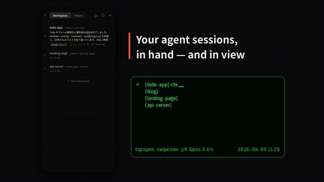

# Hrdle

[日本語](README.ja.md) | English

**Your agents, even away from the desk.**
You are no longer in front of the PC. And still, the work moves on.

Hrdle runs your coding agents — Claude Code, Codex, Grok, Kimi and OpenCode — on a machine
of yours, and puts the controls on your phone and on a pair of EVEN Realities G2 glasses.

**Start work without opening a laptop.** Not just watching — starting. Create a session,
ask by voice, answer its questions from the glasses. The PC stays closed.

The machine can be headless: no display, no keyboard, nobody sitting at it. You reach it
over Tailscale, so the only thing it owes you is staying awake.

*Hrdle = herdr + handle. A handle, held from the G2, for the thing that herds your
sessions. The hurdle of getting started is in the name too.*

> **Formerly CC Hub.** [`m0a/cc-hub`](https://github.com/m0a/cc-hub) is archived at v0.2.98 and development continues here. Existing installs keep working — that repository stays readable, so `cchub update` still resolves — and Hrdle installs alongside rather than over it (separate binary, service, port and herdr session).

## Demo



Full video: [42s](https://github.com/hrdle/hrdle/releases/download/v0.3.83/hrdle-promo-short-en.mp4) · [62s](https://github.com/hrdle/hrdle/releases/download/v0.3.83/hrdle-promo-full-en.mp4) (English) — [42秒](https://github.com/hrdle/hrdle/releases/download/v0.3.83/hrdle-promo-short-ja.mp4) · [62秒](https://github.com/hrdle/hrdle/releases/download/v0.3.83/hrdle-promo-full-ja.mp4) (日本語)

## What it does

- **Sessions and panes** — run several agents side by side, split / zoom / resize / close panes, and every connected client sees the same layout. Indicators show which sessions are working, waiting on you, or done, read from the pane itself with no hooks required. Long-press a session to give it a colour.
- **Made for touch** — tablet split layout with a draggable floating keyboard, a custom mobile keyboard with a pane tab bar, pinch-to-zoom and momentum scrolling. Long-press a number key for its symbol. On desktop, text selection with auto-copy and font-size shortcuts.
- **Reading the work** — a chat view that renders the current session as a conversation, and a file viewer with syntax highlighting, images, Markdown and HTML, showing diffs from either Claude Code's edits or git.
- **History and search** — browse and resume past sessions, full-text search across every message, prompt history from all sessions at once.
- **Dashboard** — 5-hour / 7-day usage cycles, time to reset and a projection of when you will hit the limit at the current pace, per-model token use, cost estimates, CPU / memory / swap history, WebSocket latency.
- **Several machines** — peer servers over Tailscale, auto-discovered, with sessions, history and dashboards aggregated. `hrdle send` and `hrdle peek` drive a pane on any of them from the CLI.
- **Unattended** — HTTPS through Tailscale certificates, optional password, and a systemd / launchd service with auto-restart and auto-update.

The UI is English and Japanese, detected automatically.

## Smart glasses (EVEN Realities G2)

A companion app for the G2 (`glasses/`, built with the EvenHub SDK) turns the glasses
into a read-and-answer surface for your sessions — for when the agent needs a decision
and you are not at a screen.

- **Read and answer** — session list with status indicators, conversation view, and a
  choice mode that answers `AskUserQuestion` prompts without touching a keyboard
- **Notifications go to the lenses, not the browser** — while the app is connected, hook
  events become 90-second relay items on the G2 display. If the glasses are absent or the
  session cannot be resolved, the browser notification fires as before, so nothing is lost
- **Voice input** — the G2 SDK emits raw PCM, so transcription happens server-side via
  `POST /api/glasses/stt` (Groq `whisper-large-v3-turbo`). **The audio and the API key
  never leave your host**
- **Agent-written notes** — `hrdle glasses "<text>"` lets an agent put one line in front of
  you, with optional choices to answer. The session is resolved from the working directory,
  so agents rarely need to name it
- **Simulator** — the same app builds for the browser and is served at `/glasses`, so you
  can try it without hardware

Build and distribution live in [`glasses/README.md`](glasses/README.md). The packaged
`out.ehpk` is uploaded to EVEN Hub.

## Requirements

| Dependency | Installation |
|------------|--------------|
| [Tailscale](https://tailscale.com/) | **Install this first.** Linux: `curl -fsSL https://tailscale.com/install.sh \| sh` / macOS: `brew install tailscale` (the App Store build ships no CLI, which certificate generation needs). Then `sudo tailscale set --operator=$USER`, once |
| [herdr](https://herdr.dev/) | The installer installs it if it is missing (`HRDLE_SKIP_HERDR=1` to do it yourself) |
| [Claude Code](https://docs.anthropic.com/en/docs/claude-code) | `npm install -g @anthropic-ai/claude-code`, then sign in once. Codex, Grok Build, Kimi Code and OpenCode work too |

## Install

**Setting it up with the glasses?** [The setup guide](https://hrdle-setup.abe00makoto.workers.dev)
walks through all of it — machine, agent, Tailscale, install, voice key, connect — in about
ten minutes. What follows is the same install, condensed.

With Tailscale already installed, this is the whole of it:

```bash
curl -fsSL https://raw.githubusercontent.com/hrdle/hrdle/main/install.sh | bash
```

It installs herdr if it is missing, allows certificate generation, registers the service,
and finishes by printing the server's address as a QR code for the phone app to scan.

Two things it cannot do for you:

- **`sudo tailscale set --operator=$USER`** — sudo cannot prompt for a password from a
  piped script, so if no cached credential is available the installer prints this line and
  stops short of the service. Run it, then `hrdle setup`.
- **A password.** As installed, anything signed in to your tailnet can open it. To be asked
  for one in the browser, run `hrdle setup -P mypassword`.

Set `HRDLE_NO_SERVICE=1` to install the binary only, or `HRDLE_SKIP_HERDR=1` to install
herdr yourself.

<details>
<summary>Manual installation</summary>

Download the binary for your platform from
[Releases](https://github.com/hrdle/hrdle/releases/latest) — `hrdle-linux-x64` or
`hrdle-macos-arm64` — then put it on your PATH:

```bash
chmod +x hrdle-linux-x64
mv hrdle-linux-x64 ~/bin/hrdle
echo 'export PATH="$HOME/bin:$PATH"' >> ~/.bashrc && source ~/.bashrc
```

</details>

### The service

`hrdle setup` enables auto-start on boot (systemd on Linux, launchd on macOS),
auto-restart on crash, auto-update via `hrdle update`, and a supervised herdr server with
agent conversations resumed on restart.

Sessions live in the herdr server process, so restarting or updating Hrdle never kills
them.

## Commands

```bash
# Server
hrdle                        # Start on port 5924
hrdle -p 8080                # Specify port
hrdle -P mypassword          # Start with password

# Service (auto-restart, auto-update)
hrdle setup -P mypassword
hrdle uninstall              # Remove service registration

# Update
hrdle update                 # Update to latest
hrdle update --check         # Check for updates only
hrdle update --auto          # Auto-update mode (for timer)

hrdle status                 # Service status
hrdle notify                 # Send a hook event (reads JSON from stdin)

# Print this server's address: the short form for the glasses app's Connect
# step, and the URL for a browser. (`hrdle qr` is the old name for it.)
hrdle address

# Remote pane control (target: <peer>:<session>:<paneId>)
hrdle send <target> [text]   # Send input to a pane on a local or peer server
hrdle peek <target>          # Snapshot a pane's current viewport

hrdle debug <sub>            # Bun inspector on the running service
                             # sub: enable | disable | profile | status
```

| Option | Description | Default |
|--------|-------------|---------|
| `-p, --port` | Port number | 5924 |
| `-H, --host` | Bind address | 0.0.0.0 |
| `-P, --password` | Auth password | none |
| `-h, --help` | Show help | - |
| `-v, --version` | Show version | - |

**`hrdle send`** — `<target>` is `<peer>:<session>:<paneId>`, where peer is `local`, a peer id, or a nickname:

| Option | Description |
|--------|-------------|
| `--stdin` | Read payload from stdin instead of the argument |
| `--newline` | Append `\r` to the payload (acts like pressing Enter once) |
| `--submit` | Wrap payload in bracketed paste markers + Enter (Claude Code / Codex TUI submit, works at any length) |
| `--base64` | Treat payload as base64 (binary-safe) |
| `--wait` | After sending, snapshot the pane viewport with detected state (idle / processing / permission_prompt / ask_user_question) |
| `--wait-ms <n>` | Delay before snapshot when `--wait` is set (default 800) |
| `--lines <n>` | Trailing rows to include in the viewport (default 20, also for `hrdle peek`) |

**`hrdle debug`** — `--seconds <n>` (for `profile`: enable for N seconds then auto-disable).

## Keyboard shortcuts

| Shortcut | Action |
|----------|--------|
| `Ctrl+B` | Toggle session modal |
| `Ctrl+Shift+B` | Toggle dashboard panel |
| `Ctrl+D` | Split pane vertically (right) |
| `Ctrl+Shift+D` | Split pane horizontally (bottom) |
| `Ctrl+W` | Close pane |
| `Ctrl+Arrow` | Navigate between panes |
| `Ctrl+Shift+Arrow` | Resize active pane |
| `Ctrl+Shift+=` | Equalize pane sizes |
| `Ctrl+1-9` | Switch to session by number |
| `Ctrl+=` / `Ctrl+-` / `Ctrl+0` | Font size up / down / reset |
| `Ctrl+C` (with selection) / `Ctrl+V` | Copy / paste |

## Hook notifications

Browser push notifications when Claude Code finishes a response or needs input. Add
`hrdle notify` to `~/.claude/settings.json`:

```json
{
  "hooks": {
    "Stop": [{ "hooks": [{ "type": "command", "command": "hrdle notify" }] }],
    "PostToolUse": [{
      "matcher": "AskUserQuestion",
      "hooks": [{ "type": "command", "command": "hrdle notify" }]
    }]
  }
}
```

The server must be running, and the browser must be allowed to show notifications on first
access.

Session indicators (working / waiting / done) need no hooks at all — herdr reports agent
status itself. These two carry only what herdr cannot see: the notification text, and the
name of the tool that asked a question.

Hooks run in a **non-interactive** shell, which never sources `.zshrc`/`.bashrc`. If your
PATH additions live there (a `~/bin` or `~/.local/bin` install), the bare name will not
resolve and the hook dies with `command not found`. Use the absolute path from
`which hrdle` in that case — Hrdle's own "set up hooks" button already writes it:

```json
{ "type": "command", "command": "/home/you/bin/hrdle notify" }
```

## herdr backend

Hrdle runs every session as a [herdr](https://herdr.dev/) workspace, and `hrdle setup`
provisions the lot: a supervised `herdr server`, `~/.config/herdr/config.toml` with
`resume_agents_on_restore = true`, and the Claude / Codex integration hooks for native
session identity.

To update herdr later: `herdr update`, then restart the supervised server
(`systemctl --user restart herdr`). The update replaces the binary but leaves the running
server on the old version, so the restart is what applies it — Hrdle notices that gap and
shows a dashboard warning with a button that does both steps. Restarting re-creates every
pane: agent conversations come back automatically, commands running in a pane do not,
which is why it waits for you to press it.

Do **not** use `herdr update --handoff` under systemd/launchd — the handed-off server
escapes supervision.

## Development

[Bun](https://bun.sh/) 1.0+ is required.

```bash
bun install
bun run dev             # Backend + frontend; open http://localhost:5174

bun run dev:frontend    # Frontend only
bun run dev:backend     # Backend only
bun run test            # Run all tests
bun run test:e2e        # E2E tests
bun run lint            # Lint all packages
bun run build:binary    # Single binary at ./dist/hrdle
```

**Stack** — Bun, Hono and WebSocket on the backend; React 19, Vite, Tailwind CSS v4,
xterm.js and react-i18next on the frontend; herdr's socket API plus per-pane control
streams for the terminal.

## Architecture

An interactive overview of backend services, API routes, frontend components, hooks, the
WebSocket protocol, shared types and the major data flows lives in
[`architecture.html`](architecture.html) (data: [`architecture.json`](architecture.json)).

- Render it in your browser via [raw.githack](https://raw.githack.com/hrdle/hrdle/main/architecture.html) — the JSON is embedded, no external fetch required.
- Edit `architecture.json` and run `python3 scripts/build-architecture-html.py` to refresh the embed.

## License

MIT
